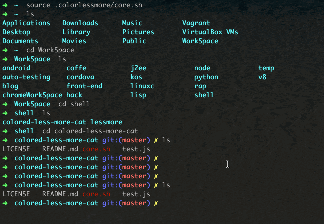

colored-less-more-cat  
==============
<pre>
_______      _                       _    _
(_______)    | |                     | |  | |
_       ___ | | ___   ____ _____  __| |  | | _____  ___  ___    ____   ___   ____ _____
| |     / _ \| |/ _ \ / ___) ___ |/ _  |  | || ___ |/___)/___)  |    \ / _ \ / ___) ___ |
| |____| |_| | | |_| | |   | ____( (_| |  | || ____|___ |___ |  | | | | |_| | |   | ____|
\______)___/ \_)___/|_|   |_____)\____|   \_)_____|___/(___/   |_|_|_|\___/|_|   |_____)

</pre>

## Preview

## Usage
The prefix 'c' means colored!:)
>     cless file

>     cmore file

>     ccat [-bn] file

All above 3 commands are the same with less, more and cat except that the output with syntax color detected by the content!
You can type `man cat`, `man less`,`man more` for more info.

## Prerequisites
>Assume that you have **pip** installed! If not please follow
[How to install pip](https://pip.pypa.io/en/latest/installing.html)

>ALSO assume that you are using oh-my-zsh, I recommend you to have a try!
[How to install oh-my-zsh](https://github.com/robbyrussell/oh-my-zsh)

## Dependencies
> Intall Pygments (http://pygments.org)

    $ sudo pip install pygments
> Then run

    $ pygmentize

> If you get something NOT LIKE 'command not found: pygmentizea', then congtatulations!

## Install
    $ git@github.com:KevinOfNeu/colored-less-more-cat.git
    $ cp -r colored-less-more-cat ~/.colored-less-more-cat
    $ sudo vim ~/.zshrc

Add the following code into your .zshrc file.

      source ~/.colored-less-more-cat/core.sh
Save, open another Terminal tab,type `cless .zshrc`,`cmore .zshrc`,`ccat .zshrc`,FLY HIGH with colored output!

##License
[MIT](./LICENSE)
